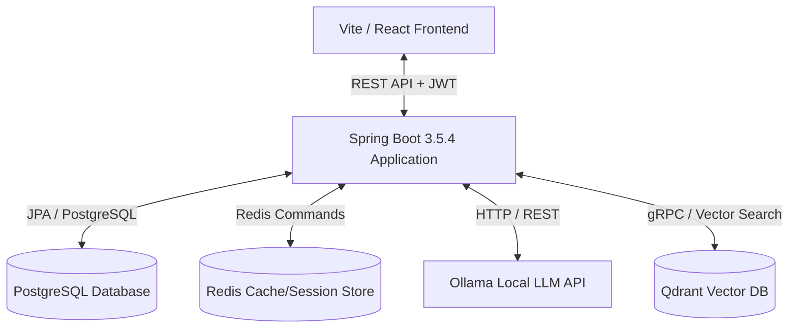

# DoctorG: AI-Powered Multi-Agent Healthcare Assistant

DoctorG is a containerized, full-stack healthcare assistant platform that simplifies clinical intake, symptom tracking, doctor matching, and reliable home care advice. 

The system leverages **Retrieval-Augmented Generation (RAG)** to provide medically grounded home care instructions derived from trusted medical documents, ensuring responses are safe, structured, and free of hallucinations.

---

## 🏗️ System Architecture



### Tech Stack
- **Frontend**: React (Vite), Redux Toolkit, TailwindCSS, Axios
- **Backend**: Spring Boot 3.5.4 (Java 21), Spring Security, Hibernate/JPA
- **Databases**: PostgreSQL (relational), Redis (live chat cache), Qdrant (vector index)
- **AI Orchestration**: LangChain4j, Ollama (`qwen3:1.7b` LLM and `nomic-embed-text` embeddings)

---

## 🌟 Key Features

### 1. Patient Portal
- **AI Symptom Intake Chat**: Natural conversations collecting symptoms, duration, and history without diagnosing or prescribing.
- **Home Care Advice Cards**: Instantly retrieves and summarizes medically-grounded suggestions from ingested PDFs.
- **Interactive Booking**: Find doctors by city and specialty, select date and time slots, and specify appointment reasons.
- **Visits List & Rescheduling**: View active scheduled appointments, reschedule date/time, cancel bookings, or toggle to view past/cancelled visits.

### 2. Doctor Dashboard
- **Profile Configuration**: Custom bio, fees, qualifications, experience, and clinic address.
- **Schedule Management**: Real-time stats (today's bookings, pending requests, total unique patients) and options to Accept or Cancel pending requests.
- **Patient Records**: Automatically aggregates unique patient files based on appointment history.

### 3. Admin Control Center
- **Healthcare Professional Onboarding**: Register new doctors with auto-created default profiles.
- **Live Stats Grid**: Interactive cards displaying total patients, active AI sessions (from Redis), and registered doctors.
- **Conditional List Views**: Toggle cards to show either the registered patient list or doctor list with remove functionality.

---

## 🚀 How to Run the Project (Step-by-Step)

### Prerequisites
Make sure you have the following installed on your machine:
- [Docker Desktop](https://www.docker.com/products/docker-desktop/)
- [Java Development Kit (JDK 21)](https://adoptium.net/)
- [Maven](https://maven.apache.org/download.cgi)
- [Node.js (v18+) & npm](https://nodejs.org/)

---

### Step 1: Start Containerized Services
DoctorG provides a `compose.yaml` file containing PostgreSQL, Redis, Qdrant, and Ollama.

Navigate to the `doctorG` directory and run:
```bash
docker-compose up -d
```

Verify that the services are running on their default ports:
- **PostgreSQL**: `5432`
- **Ollama**: `11434`
- **Qdrant**: `6333` (HTTP) / `6334` (gRPC)
- **Redis**: `6379`

---

### Step 2: Download AI Models in Ollama
Open your terminal and pull the LLM and Embedding models locally:
```bash
# Pull the LLM (Qwen 1.7B)
docker exec -it ollama ollama pull qwen3:1.7b

# Pull the Embeddings Model
docker exec -it ollama ollama pull nomic-embed-text
```

---

### Step 3: Ingest Medical Reference Documents
To ground the AI home care responses, you need to load medical PDF reference files into the Qdrant database:

1. Send a POST request to `http://localhost:8080/api/medical-advice/ingest` (or use the document upload feature in the Admin panel).
2. The backend splits the PDFs (500-char chunks, 50-char overlap), embeds them using `nomic-embed-text`, and stores them in Qdrant.

---

### Step 4: Run the Backend Application
1. Configure database parameters in [application.yml](file:///c:/Users/Arvind%20Kumar/OneDrive/Desktop/DoctorG/doctorG/src/main/resources/application.yml) (or the overriding properties).
2. Run the Spring Boot application from the `doctorG` folder:
```bash
mvn clean spring-boot:run
```
The server will start on port `8080`.

---

### Step 5: Run the Frontend Application
1. Open a new terminal and navigate to the `frontend` directory.
2. Install dependencies:
```bash
npm install
```
3. Start the Vite development server:
```bash
npm run dev
```
The application will launch in your browser at `http://localhost:5173`.

---

## 📁 Repository Structure

```
DoctorG/
├── doctorG/                  # Backend Spring Boot Project
│   ├── src/main/java/        # Java Source Code
│   │   └── com/docG/DoctorG/
│   │       ├── agent/        # AI Symptoms Agent
│   │       ├── controller/   # REST Controllers (Auth, Patients, Doctors, Admins)
│   │       ├── entity/       # Database JPA Entities
│   │       └── service/      # Business Logic & RAG Services
│   ├── compose.yaml          # Docker Compose configuration
│   └── pom.xml               # Maven Dependency Manager
│
└── frontend/                 # Frontend React (Vite) Project
    ├── src/
    │   ├── features/         # Redux Slices (Auth, Diagnostic Sessions)
    │   ├── pages/            # Page components (Dashboard, Appointment, Profile)
    │   └── main.jsx          # App Entry point
    └── package.json          # Node dependencies & npm scripts
```
